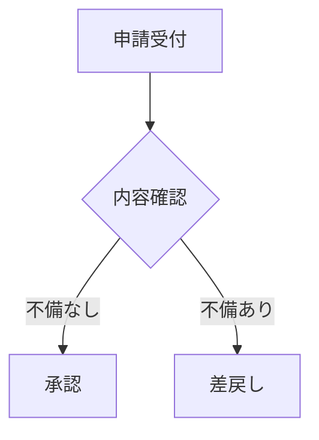
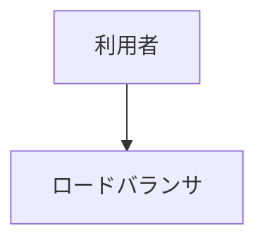

# docmold

Markdown を、**内容の種類ごとに表現を変えた自己完結 HTML** に変換する CLI ツール。

議事録・作業手順書・障害報告・設計書・週次報告を、それぞれに合った構造 / 意味づけ / 見た目で出力します。
出力は CSS・JS・画像を埋め込んだ 1 ファイルで、外部参照を持ちません（閉域ネットワーク / CDN 不可の前提）。

## 主要機能

- **種類ごとの表現切り替え**: front matter の `type:` 1 行で、テンプレート・ルール・テーマがまとめて切り替わる
- **3 層分離**: 構造（テンプレート）/ 意味づけ（ルール）/ 見た目（テーマ）を独立に組み合わせる
- **YAML 駆動**: 種類の追加は「YAML 数行 + 必要ならルール関数 1 つ」。判定ロジックは設定に持たない
- **完全自己完結 HTML**: CSS / JS / 画像（base64）を 1 ファイルに埋め込み、外部参照ゼロ
- **本文の生 HTML を既定で絞る**: 配布物に `<script>` が紛れ込まない（種類ごとに解除可）
- **印刷（PDF 化）前提**: 手順書は見出しごとに改ページ、設計書は表紙を 1 ページ目に
- **一括変換 + 索引**: ディレクトリ再帰と索引 HTML の生成

---

## 目次

**入門**
1. [クイックスタート](#クイックスタート)
2. [動作要件](#動作要件)

**使い方ガイド**
3. [メニューから実行する](#1-メニューから実行する)
4. [種類を指定する](#2-種類を指定する)
5. [一括変換する](#3-一括変換する)
6. [表現を調整する](#4-表現を調整する)
7. [種類を追加する](#5-種類を追加する)
8. [PDF 化する](#6-pdf-化する)
9. [図を使う](#7-図を使う)
10. [生の HTML を扱う](#8-生の-html-を扱う)
11. [節を横に並べる](#9-節を横に並べる)
12. [リンクを書く](#10-リンクを書く)

**リファレンス**
13. [同梱の種類](#同梱の種類)
14. [CLI オプション一覧](#cli-オプション一覧)
15. [出力先](#出力先)
16. [設定ファイル](#設定ファイル)
17. [ルール一覧](#ルール一覧)
18. [front matter のキー](#front-matter-のキー)
19. [Exit code](#exit-code)
20. [既知の制約](#既知の制約)
21. [ファイル構成](#ファイル構成)

**開発者向け**
22. [設計方針](#設計方針)
23. [テスト](#テスト)
24. [変更履歴](#変更履歴)

---

## クイックスタート

**メニューから使う**（CLI オプションを覚えなくてよい）:

```cmd
:: menu.bat をダブルクリック、またはコマンドから
cd C:/tools/docmold
menu.bat
```

**CLI から使う**:

```cmd
:: 1. Anaconda Prompt（通常権限）で展開先に移動
cd C:/tools/docmold

:: 2. 指定できる種類を確認
python docmold.py --list-types

:: 3. .md の先頭に種類を書いて変換
python docmold.py 議事録.md
:: → C:/tools/docmold/out/20260914-213045/議事録.html
```

出力先は **docmold 自身の `out/` 配下に、実行日時のフォルダを作って** その中に出します
（詳しくは [出力先](#出力先)）。

変換対象の `.md`：

```markdown
---
type: minutes
title: 定例会 議事録
日時: 2026-09-14 10:00-11:00
出席者: [山田太郎, 鈴木花子]
---

## 決定事項

- 本番切替は 10/18 に実施する。

## ToDo

- [ ] 手順書の作成 担当: 鈴木
```

`examples/` に 7 種類のサンプルがあります。まとめて出力して見比べられます：

```cmd
python docmold.py examples -o out --index
```

---

## 動作要件

- **Python 3.9 以上**
- 依存パッケージはすべて **Anaconda 同梱**

| パッケージ | 用途 |
| --- | --- |
| `markdown` | Markdown → HTML |
| `jinja2` | テンプレート描画 |
| `pyyaml` | front matter / 設定ファイル |
| `beautifulsoup4` | ルール層の DOM 後処理 |
| `pygments` | コードハイライト（無い場合は色なしで動作） |

Anaconda 以外の環境では:

```bash
pip install -r requirements.txt
```

**依存は「実行に使う Python」に入っている必要があります。** 別のツールの仮想環境や、
依存を入れていない Python で起動すると、次の案内が出て終了コード 2 で止まります。

```
必要なライブラリが入っていません: Markdown, Jinja2, beautifulsoup4

  実行中の Python: /path/to/other-tool/.venv/bin/python

次のいずれかで解決できます。
  1) この Python に入れる
     /path/to/other-tool/.venv/bin/python -m pip install -r /path/to/docmold/requirements.txt
  2) 依存が入っている Python で実行する
```

どの Python で動いているかが表示されるので、取り違えていないか確認してください。

---

## 使い方ガイド

### 1. メニューから実行する

CLI オプションを覚えなくても、番号を選ぶだけで実行できます。

```cmd
:: Windows はこれをダブルクリック
menu.bat

:: コマンドから起動する場合
python menu.py
```

```
============================================================
  docmold（Markdown → 自己完結 HTML）
============================================================
  設定: C:/tools/docmold/profiles.yaml（6 種類）

============================================================
  操作を選択
============================================================
  1. 変換する ― Markdown を自己完結 HTML に変換する ←前回
  2. 種類の一覧 ― front matter の type に書ける名前を表示する
  3. ルールの一覧 ― 種類ごとの意味づけ（後処理）を表示する
------------------------------------------------------------
  0. 終了
============================================================
```

「変換する」を選ぶと、変換対象 → 種類 → 出力先 → 索引の有無 → 実行モードの順に尋ねます。

- **変換対象** は `.md` かディレクトリ。Windows のドラッグ＆ドロップで付く引用符は自動で外します
- **種類** は前回選んだものが既定。初回は「front matter に従う」で、
  別の表現で出したいときだけ上書きを選びます
- **出力先** は既定（`docmold/out/<日時>/`）か、場所の指定かを選びます
- **索引** はディレクトリを指定したときだけ尋ねます
- **実行モード** で「検証のみ」を選ぶと `--dry-run` 相当（HTML を書き出しません）
- 変換後に出力先をエクスプローラ / Finder で開けます

選んだ値は `~/.docmold_menu.json` に記憶され、次回の既定値になります
（`←前回` と表示され、Enter でそのまま選べます）。

ランチャーから起動する運用にも、この `menu.py` をそのまま呼び出せます。

> 無人実行（バッチ・タスクスケジューラ）ではメニューではなく `docmold.py` を直接呼んでください。
> その際は `--strict` を付けると、警告を取りこぼしません（下記）。

### 2. 種類を指定する

種類は **書き手が明示したものだけ** を見ます。パス名や本文からの自動判定は行いません
（誤判定で事故るうえ、ルールの保守コストが乗るため）。

**front matter に書く**（基本）:

```markdown
---
type: incident
---
```

**CLI で上書きする**（既存の `.md` を書き換えずに別表現で出したいとき）:

```cmd
python docmold.py 手順.md --type procedure
```

**指定しない場合**は `default`（汎用テンプレート・目次なし）で変換されます。

> 未知の `type` が書かれていた場合は、黙って `default` に落とさず **警告を出したうえで `default` で処理** します。
> タイプミスに気づけないまま変換されるのを防ぐためです。

### 3. 一括変換する

ディレクトリを渡すと `.md` / `.markdown` を再帰的に変換し、階層を保って出力します。

```cmd
:: docs/ 配下をすべて変換し、索引 HTML も作る
python docmold.py docs --index
```

```
docs/                          out/20260914-213045/
├── 定例.md          →         ├── 定例.html
├── 障害/                      ├── 障害/
│   └── 0910.md      →         │   └── 0910.html
└── 設計.md          →         ├── 設計.html
                               └── index.html   ← --index で生成
```

索引 HTML はタイトル・種類・日付・元ファイルの一覧で、本体と同じく自己完結 1 ファイルです。
**front matter の日付の新しい順**に並び、日付を持たない文書は最後にまとめます。

日付として拾うキーは `日時` / `実施日` / `発生日時` / `作成日` / `期間` など
（`keywords` の `index_date` グループで変えられます）。

どの文書も日付を持たず、入力が複数のディレクトリにまたがるときは、
**入力のディレクトリごとに区切って**並べます。設計書のように日付を書かない文書セットで、
索引から構成が読み取れるようにするためです。日付を持つ文書があれば、区切らず新しい順のままにします。

「元ファイル」の列は、**入力に渡したディレクトリからの相対パス**で出ます。絶対パスで渡しても
相対パスで出るため、索引を配布したりコミットしたりしても、変換した端末のディレクトリ構成は残りません。

索引には生成時刻が入ります。差分管理したい場合は `--reproducible` を付けると省かれます。

一括変換で気をつける点が 2 つあります。

- **文書どうしの相対リンクを保つなら、共通の親ディレクトリを入力にします。**
  `docs/` だけを渡すと、`docs/` から外へ出る相対リンク（`../prompts/…`）は変換対象外になり、
  リンク切れになります。
- **ディレクトリへのリンク**（`[ADR](adr/)`）は HTML には向け先が無いため、警告して変換します。
  GitHub 上ではディレクトリを開けるので Markdown としては正しい書き方ですが、HTML 化すると切れます。

**文書間のリンクはそのまま繋がります。** `[設計書](設計書.md)` のような相対リンクは
`.html` に書き換えられ、入力の階層を出力に写すため、リンク先も同じ位置関係に出力されます。
外部 URL（`https://` `mailto:`）とページ内アンカー（`#節`）は書き換えません。

> リンク先が変換対象に含まれるかまでは確認しません。入力に含まれない `.md` への参照は、
> 書き換えても切れたままです。

**見出しの id は GitHub と同じ規則で作ります。** 同じ `.md` を GitHub でも HTML でも読む
使い方で、`[概要](#概要)` のような文書内リンクが両方で成立するようにするためです。

| 見出し | id |
| --- | --- |
| `## 概要 (説明)` | `#概要-説明` |
| `## 常設の指示 — 登録する` | `#常設の指示--登録する`（記号が消えて空白が隣り合うため） |
| `## A-6 世代管理　実装仕様書` | `#a-6-世代管理実装仕様書`（**全角空白は区切りにならず消えます**） |
| `## 概要` が 2 つ目 | `#概要-1` |

### 4. 表現を調整する

同梱の定義を変えたいときは `config.yaml` に **差分だけ** 書きます。

```cmd
copy config.example.yaml config.yaml
```

```yaml
profiles:
  incident:
    watermark: false      # 確定版なので DRAFT 透かしを消す
  spec:
    toc:
      depth: 4            # 目次を 4 階層まで

themes:
  corporate:
    accent: "#006c4b"     # 自社色に差し替え
```

同梱の `profiles.yaml` に再帰マージされるため、書かなかったキーは既定のまま残ります。
`profiles.yaml` は直接編集しないでください（ツール更新で上書きされます）。

### 5. 種類を追加する

**表現の組み合わせを変えるだけなら YAML 数行** で済みます。

```yaml
profiles:
  review:
    description: レビュー記録
    template: article.html        # 既存テンプレートを再利用
    theme: corporate
    toc: true
    rules: [todo_checklist, status_badge]
    meta_header: [対象, レビュー日, 参加者]
```

**新しい意味づけが要るとき** は、ルール関数を 1 つ足します。

```python
# rules/review.py
from rules import rule
from rules.common import add_class, find_headings

@rule("review_severity")
def review_severity(soup, meta):
    """「指摘」節の見出しに重要度クラスを付ける。"""
    for heading in find_headings(soup, ["指摘"]):
        add_class(heading, "dm-review-finding")
```

`rules/__init__.py` の末尾の import に `review` を足せば、`--list-rules` に出て YAML から使えます。

### 6. PDF 化する

記録として残す場合は、ブラウザの印刷 → PDF 保存を使います。`@media print` を用意済みです。

| 種類 | 印刷時の挙動 |
| --- | --- |
| `procedure` | 見出し（手順）ごとに改ページ。コピーボタン・画面用の注記は印刷されない |
| `spec` | 表紙が単独で 1 ページ目。章ごとに改ページ |
| `incident` | DRAFT 透かしを全ページ中央に薄く配置 |
| 共通 | ページ番号（`1 / 5`）が下端に入る。手順カード・サマリカード・表の行がページ境界で分断されない |

ブラウザの印刷設定で「背景のグラフィック」を有効にしてください（バッジや見出しの色が出ます）。

ページ番号は CSS で入れています。**Chrome / Edge でのみ表示されます**（Firefox / Safari は
CSS のマージンボックスに未対応）。それ以外のブラウザでは、印刷ダイアログの
「ヘッダーとフッター」を有効にすると、ブラウザ自身がページ番号を付けます。
表紙のある `spec` では、表紙（1 ページ目）に番号を出しません。

### 7. 図を使う

Mermaid の図を書けます。同梱の設定では **`spec`（設計書）だけ有効**で、
`mermaid: cdn`（CDN から読み込む）になっています。他の種類で使う場合や、
読み込み方を変える場合は `config.yaml` に書きます。

```yaml
profiles:
  minutes:
    mermaid: cdn          # 議事録でも図を使う
  spec:
    mermaid: false        # 設計書では図を使わない（外部参照をなくす）
```

Markdown 側は `mermaid` を指定したコードブロックとして書きます。

````markdown

````

`mermaid` が無効な種類では、ただのコードブロックとして表示されます。

#### 図に番号を付ける

`spec` では図にも表と同じように通し番号が付きます。図の直前に「図: 説明」の行を置くと、
キャプションになります。

````markdown
図: 全体構成


````

「図 1: 全体構成」として採番され、本文中の「図 1」がその図へのリンクになります。
`examples/設計書.md` が実例です。

#### 読み込み方の選択

| 設定 | 動作 | ファイルサイズ | 閲覧条件 |
| --- | --- | --- | --- |
| `mermaid: cdn` | CDN から読み込む | そのまま（数十 KB） | **インターネット接続が必要** |
| `mermaid: true` | `assets/mermaid.min.js` を埋め込む | **+約 3.4 MB / ファイル** | 接続不要 |
| `mermaid: "https://..."` | 指定 URL から読み込む | そのまま | その URL に到達できること |
| 省略 / `false` | 無効 | — | — |

> **`cdn` にすると、その種類の HTML は自己完結ではなくなります。** 閉域ネットワークや
> オフラインで開くと、図の部分は定義テキストのまま表示されます（本文とレイアウトは
> 影響を受けません）。図が出ないと困る配布先がある場合は `mermaid: true` を選び、
> ファイルサイズを許容してください。

社内にホスティングした mermaid.js を使う場合は URL を直接指定できます。
改ざん検知を付けるなら `integrity` も指定できます。

```yaml
profiles:
  spec:
    mermaid:
      url: "https://intra.example.com/lib/mermaid@11/mermaid.min.js"
      integrity: "sha384-..."     # 任意
```

### 8. 生の HTML を扱う

Markdown の仕様では、`.md` に直接書いた HTML はそのまま出力されます。docmold の出力は
ファイルサーバやメールで配布されるため、**既定では許可リストで絞ります**。

| `.md` の記述 | 既定（`strict`） |
| --- | --- |
| `<script>alert(1)</script>` | 中身ごと削除 |
| `` | `onerror` だけ削除（画像は残る） |
| `<a href="javascript:...">押す</a>` | リンクを無効化（文字は残る） |
| `<iframe>` `<form>` `<svg>` | 削除 |
| `<a href="file:///…">` | リンクを無効化（`allow_schemes` で通せる） |
| `<div style="color:red">` | `style` を削除（文字は残る） |
| `<br>` `<details>` `<abbr>` | **そのまま残る** |
| `**強調**` `[リンク](設計書.md)` などの Markdown 記法 | **影響なし** |
| 表の桁揃え（`| ---: |`）| **影響なし** |

落とした箇所があると警告が出ます。

```
警告: 定例.md: 本文の HTML を 3 箇所ほど除きました（sanitize: strict。素通しにするには sanitize: false）
```

#### 素通しに戻す

自分で書いた `.md` しか変換せず、HTML を自由に使いたい場合は解除できます。

```yaml
# 全体の既定を変える
sanitize: false

# 種類ごとに変える（設計書だけ HTML を自由に使う）
profiles:
  spec:
    sanitize: false
```

種類ごとの指定が、全体の既定より優先されます。

#### ファイルサーバへのリンクを通す（`allow_schemes`）

`file:` のリンクは既定で無効化されます（配った先の手元のファイルを指さないため）。
**閉域で配る前提の種類だけ通す**こともできます。

```yaml
profiles:
  weekly3:
    allow_schemes: [file]
```

```markdown
- [手順書](file:///C:/docs/手順.xlsx)
```

同梱の `weekly3` は既定で `file` を通します。ほかの種類は落とします。

- 通せるのは `file` / `about` だけです。`javascript` などは書いてもエラーになります。
- `<file:///…>` の書き方は**使えません**。python-markdown が `file:` を自動リンクの
  対象にしておらず、HTML のタグとして読まれて消えます。角括弧で書いてください。
- リンク先が HTML と同じ場所にあるなら、相対パス（`[手順書](手順.xlsx)`）や
  UNC（`[共有](//server/share/手順.xlsx)`）の方が確実です。

> 許可リストは `sanitize.py` にあります。ルール層やテンプレートが作る要素
> （チェックボックス、コピーボタン、Mermaid の読み込み）はサニタイズの後に
> 組み立てるため、影響を受けません。

---

### 9. 節を横に並べる

`type: weekly3` は、**見出し 2（`##`）を 4 つ書く前提の種類**です。
「前週 / 今週 / 来週の予定」のように、同じ形のものを並べて見比べる用途を想定しています。

| `##` の位置 | 扱い |
| --- | --- |
| 1 つ目 | 横幅いっぱいの 1 列（トピックス） |
| 2 〜 4 つ目 | 3 つの列 |

**位置だけで決めます。** 見出しの文字列は見ないので、名前は自由に付けられます。
`##` が 4 つでない場合は警告が出ます（処理は続きます。`--strict` を付けると失敗扱いになります）。

```
警告: 課題.md: 見出し 2 は 4 個で書いてください（1 つ目がトピックス、残りが列）。今は 3 個です
```

列の中に小見出し（`###`）を書くと、**小見出しごとにまとめ直し、その中に 3 列が並びます**。

```
## 前週      ### バグ対応 ┐            バグ対応
## 今週      ### バグ対応 ┼─ 組み替え →   [前週] [今週] [来週]
## 来週の予定 ### バグ対応 ┘            改善要望
                                        [前週] [今週] [来週]
```

ある分類が一部の期間にしか無い場合も、列の位置がずれないよう枠だけ残します。
`###` を書かなければ、3 つの節がそのまま 3 列になります。

`####` を書くと、**サブ項目ごとにもう一段まとめ直し、その中に 3 列が並びます**。
`###` と同じ組み替えが 1 段深く入るイメージです。

```markdown
### バグ対応

#### 画面まわり

残:1 / 新規:0 / 再オープン:1 / 完了:0 / 未完了:2

- WEB-097｜期限：3/20｜処理中｜管理画面の一覧表示が遅い

#### ログイン・認証

残:1 / 新規:0 / 再オープン:0 / 完了:0 / 未完了:1

- WEB-118｜期限：3/13｜未対応｜パスワード再設定メールが届かない
```

```
バグ対応
  画面まわり     [前週] [今週] [来週]
  ログイン・認証  [前週] [今週] [来週]
改善要望
  （サブ項目なし） [前週] [今週] [来週]
```

サブ項目を書かない分類はそのまま 3 列になるので、**分類ごとに混在できます**。

件数の並びは、**サブ項目ごとに書けます**（`####` の直下）。分類全体の件数として
書きたい場合は `####` より前に置いてください。その内容はサブ項目の上の行にまとまります。

列の名前（前週・今週・来週の予定）は、**サブ項目の行ごとに**出します。
どの行だけを見ても、どの列がどれか分かるようにするためです。

なおトピックスの枠の中にも `####` は書けます。こちらは組み替えず、枠の中の
サブ項目としてそのまま表示します。

全体はこう書きます。

```markdown
---
type: weekly3
title: 課題サマリー
開始日: 2026-03-09
報告者: 鈴木花子
---

## トピックス

### 移行リハーサル

3/18 に実施する。当日は問い合わせ窓口を 1 名増やす。

### 文字化けの調査

出力周りの点検を今週中に一巡させる。

## 前週

### バグ対応

#### 画面まわり

残:1 / 新規:1 / 再オープン:0 / 完了:1 / 未完了:1

- WEB-104｜期限：3/6｜完了｜添付ファイルの削除が一覧に反映されない
- WEB-097｜期限：3/20｜処理中｜管理画面の一覧表示が遅い

### 改善要望

...

## 今週

...

## 来週の予定

...
```

出力例は [`examples/課題サマリー.md`](examples/課題サマリー.md) →
[`examples/html/課題サマリー.html`](examples/html/課題サマリー.html) を参照してください。

#### トピックスを書く（`topic_cards`）

1 つ目の節では、**`###` ごとに枠が分かれます**。`###` から次の `###` までが 1 枠で、
枠の中は段落でも箇条書きでも、何行でも構いません。枠は縦に積まれ、見出しには
`１．` `２．` … の通し番号が付きます（md 側に番号を書く必要はありません）。

```markdown
## トピックス

### 移行リハーサル

3/18 に実施する。当日は問い合わせ窓口を 1 名増やす。

### 文字化けの調査

出力周りの点検を今週中に一巡させる。

- 影響範囲の切り分けは 3/17 まで
- 修正方針の確認は 3/19 の定例
```

`###` より前に書いた内容は、枠の外（見出しの直下）に残ります。
`###` を 1 つも書かなければ、枠には分かれません。

**枠が 2 つ以上あると、節の先頭に「目次」が付きます**（`topic_index`）。枠の見出しを
書いた順に並べ、それぞれの枠へのリンクになります。md 側に書く必要はありません。
見出しの文言は `rules/weekly3.py` の `INDEX_TITLE` で変えられます。

**`####` は枠を分けず、枠の中のサブ項目になります。** 列側と違って組み替えはせず、
書いた場所にそのまま出ます。

#### 件数を並べる（`count_summary`）

`ラベル:数値` を `/` でつないだ**だけの段落**が、件数の並びになります。

```markdown
残:4 / 新規:2 / 再オープン:0 / 完了:3 / 未完了:3
```

全角の `：` `／` でも書けます。1 つでも形が崩れている場合
（`残:3 件あります / 新規:1` など）は、普通の段落のままにします。

#### 1 行 1 件で書く（`entry_card`）

列は狭いため、表ではなく**リスト 1 行 = 1 件**で書きます。
`｜`（半角の `|` も可）で区切った欄を、次の順に読みます。

```
見出し｜属性｜属性…｜説明
```

| 欄 | 出力 |
| --- | --- |
| 最初 | 見出し（等幅・強調） |
| 間 | 属性。[状態を表す語](#検出語を調整するkeywords)ならバッジになる |
| 最後 | 説明（次の行に表示） |

- 欄が 2 つなら「見出し + 説明」になります。
- 説明を付けたくない場合は、末尾の欄を空にします（`WEB-097｜処理中｜`）。
- 欄の中のリンクや強調はそのまま残ります（`[WEB-097](...)｜処理中｜...`）。
- `｜` を含まない項目は普通の箇条書きのままです（連絡事項などをそのまま書けます）。

**1 件にコメントを添える**には、項目の下に字下げして書きます。

```markdown
- WEB-097｜期限：3/20｜処理中｜管理画面の一覧表示が遅い
    - 3/19 に再現手順を共有済み。件数の多い条件でのみ発生する。
- WEB-104｜期限：3/6｜再オープン｜添付ファイルの削除が一覧に反映されない
    - 別の画面で同じ事象が報告されたため再オープン。
    - 3/13 の定例で対応方針を決める。
```

字下げした内容はカードの下段に、区切り線を挟んで入ります。箇条書きでも段落でも構いません。

> **字下げは半角スペース 4 文字（またはタブ）です。** 2 文字だと入れ子にならず、
> 同じ階層の項目として並びます（python-markdown の仕様で、警告も出ません）。

#### 表を箇条書きで書く（`list_table`）

`| --- | --- |` の桁合わせを書かずに、**箇条書きから表を作れます**。
`表:` の行を目印にして、その直後の箇条書きを表に変換します。

```markdown
表: 準備作業｜担当｜進捗｜状態

- 手順の最終確認
    - 鈴木
    - 80%
    - 進行中
- 連絡体制の確認
    - 田中
    - 100%
    - 完了
```

| 準備作業 | 担当 | 進捗 | 状態 |
| --- | --- | --- | --- |
| 手順の最終確認 | 鈴木 | 80% | 進行中 |
| 連絡体制の確認 | 田中 | 100% | 完了 |

**親の行が 1 列目、字下げした子の行が 2 列目以降**です。子の行は書いた順に列へ入ります。
列名を直すのは `表:` の 1 行だけで、1 セルの修正は 1 行の修正で済みます。

| 書き方 | 意味 |
| --- | --- |
| 子の行をそのまま並べる | 上から順に 2 列目、3 列目… |
| `-` だけの行 | その列は空欄 |
| `状態: 未着手` | 名前で指定。残りの行は空いている列へ |
| さらに字下げした箇条書き | そのセルの中の箇条書き |

途中の列を飛ばすときは `-` を置くか、列名を書いてください。

```markdown
- 当日の要員手配
    - 山田
    - -            ← 進捗は空欄
    - 未着手
- 予備日の確保
    - 佐藤
    - 状態: 未着手   ← 進捗を飛ばす
```

##### セルの中に箇条書きを書く

子の行の**さらに下に字下げ**すると、その箇条書きはセルの中に入ります。

```markdown
表: 作業｜担当｜補足

- 手順の最終確認
    - 鈴木
    - 次の 2 点
        - 3/19 に共有済み
        - 再現条件を確認中
```

| 作業 | 担当 | 補足 |
| --- | --- | --- |
| 手順の最終確認 | 鈴木 | 次の 2 点 ＋ 箇条書き 2 行 |

**箇条書きだけのセル**にしたいときは、`- -` と書いてからその下に並べます。

```markdown
- 連絡体制の確認
    - 田中
    - -
        - 窓口を 1 名増やす
        - 連絡網は更新済み
```

`-` だけの行（`- -` の 2 つ目の `-`）は「その列は空欄」の指定なので、
**「空欄 + 下に箇条書き」**と読みます。`-` を省いて字下げだけで書くことはできません
（`-` の無い行を Markdown が見出しの下線と読み、表示が崩れます）。

**1 列目（親の行）の中には箇条書きを書けません。** 親の直下の箇条書きは
「2 列目以降」として使うためです。必要なときは列の順番を入れ替えてください。

**表は幅いっぱいに広がり、余った幅は最後の列が受け持ちます。** 最後より前の列は
中身の幅に収まり、折り返しません。**長い文は最後の列に置いてください**
（前の列に長い文を置くと、その列が広がって表が横に伸びます）。

**列の数が合わない行は警告します**（処理は続きます）。数え間違いをツール側で拾うためです。

```
警告: 週報.md: 表「準備作業」の 3 行目は 4 列のところ 3 個でした
```

列名を書いた行がある場合は、意図して飛ばしたものとみなして警告しません。

- 変換後は**普通の表**なので、`status_badge` / `progress_bar` がそのまま効きます。
- **子のインデントは半角スペース 4 文字（またはタブ）**です（2 文字では入れ子になりません）。
- 目印の語は `keywords` の `table_marker` で差し替えられます（既定: `表` / `テーブル` / `table`）。
- 桁揃え（`--:`）の指定はできません。必要なときは Markdown の表で書いてください。
- `表:` の行の後ろが箇条書きでない場合は何もしません（設計書の「表: 説明」は影響を受けません）。

#### バッジを直接書く

状態の色分けは表の「状態」列で自動的に付きますが、**`<span>` を書けばどこにでも置けます**
（段落の中、普通の箇条書き、見出しなど）。

```markdown
<span class="dm-badge dm-badge--info">お知らせ</span>
3/20 は祝日のため、定例は 3/19 に振り替える。

リリース判定は <span class="dm-badge dm-badge--ok">完了</span> です。

- 手順書の改訂 <span class="dm-badge dm-badge--ok">完了</span>
- 監視設定の見直し <span class="dm-badge dm-badge--danger">未着手</span>
```

見出しの中にも置けますが、見出しが帯になる種類（`weekly3`）では帯と重なって
読みにくくなります。**本文の先頭に置く**のが分かりやすいです。

| クラス | 色 | 用途 |
| --- | --- | --- |
| `dm-badge--ok` | 緑 | 完了・正常 |
| `dm-badge--warn` | 黄 | 対応中・注意 |
| `dm-badge--danger` | 赤 | 未対応・異常 |
| `dm-badge--info` | 青 | お知らせ・補足 |
| `dm-badge` のみ | 灰 | 区分のない見出し語 |

色はテーマの CSS 変数（`ok` / `warn` / `danger` / `info`）から取ります。
`sanitize: strict` でも `span` と `class` は残るため、そのまま書けます。

#### 自由に書く

列の中は **Markdown をそのまま書けます**。段落・箇条書き・番号付きリスト・表・
引用・コードブロック・リンクは、いずれもそのまま出ます。
1 件 1 行の書き方に合わせる必要はありません。

意味づけが効くのは、**その形で書いたときだけ**です。

| 書いたもの | 変換 |
| --- | --- |
| `｜` を含む箇条書きの項目 | 1 件のカード |
| `ラベル:数値 / ラベル:数値` だけの段落 | 件数の並び |
| 「状態」「進捗」列を持つ表 | バッジ・進捗バー |
| それ以外 | そのまま |

普通の項目と `｜` の項目が混ざった箇条書きでは、普通の項目は行頭記号のまま残ります。

> 表は列幅が狭いため、列が多いものは列の中で横スクロールになります。
> 幅が要るものはトピックス側に置いてください。

#### 節の数を決めずに使う（`group_columns` を外す）

4 つという決めごとを外し、**節をそのまま列にする**こともできます
（「前週の中にバグ対応と改善要望」という並び。節の数は自由で、警告も出ません）。
`config.yaml` でルールを外します。

```yaml
profiles:
  weekly3:
    rules: [count_summary, entry_card, status_badge, progress_bar]
```

このとき 1 列の節とトピックスの枠も無くなります（`topic_cards` は
`group_columns` が 1 列にした節に効くため）。

---

### 10. リンクを書く

種類によらず共通の書き方です。

| 書きたいもの | 書き方 |
| --- | --- |
| Web ページ | `[社内ポータル](https://example.com/portal)` |
| URL をそのまま見せる | `<https://example.com/portal>` |
| 別の文書 | `[設計書](設計書.md)` → `.html` に書き換わる |
| 同じ場所のファイル | `[手順書](手順.xlsx)` |
| ファイルサーバ | `[共有](//server/share/手順.xlsx)` |
| ローカルの絶対パス | `[手順書](file:///C:/docs/手順.xlsx)`（`allow_schemes` の指定が要る） |

#### 素の URL はリンクになりません

```markdown
https://example.com/portal        ← ただの文字列
<https://example.com/portal>      ← リンク
```

山括弧で囲めばリンクになります。ただし**自動リンクになるのは
`http` / `https` / `ftp` / `mailto` だけ**です。`<file:///…>` は Markdown が
リンクと判断せず、HTML のタグとして読まれて**表示が消えます**（警告は出ます）。
`file:` は必ず角括弧で書いてください。

#### `\`（円記号）は消えることがあります

`\` は Markdown のエスケープ文字です。**次が記号のときだけ**、その `\` が消えます。

| 書いたもの | 結果 |
| --- | --- |
| `C:\docs\手順.xlsx` | `C:\docs\手順.xlsx`（無事） |
| `C:\docs\_下書き\*案.xlsx` | **`C:\docs_下書き*案.xlsx`** |
| `\\server\share\手順.xlsx` | **`\server\share\手順.xlsx`** |
| `[C:\docs\](…)` | **リンクにならない**（`\]` と読まれる） |

リンク先でも表示文字でも本文でも同じように起こり、**警告は出ません**。
「普通のパスは平気なのに、特定のパスだけ崩れる」ため気付きにくい箇所です。

##### 対処

**基本は `/` で書くこと**です。Windows は `/` 区切りのパスも受け付けるので、
エスケープを気にせずに済みます。

```markdown
- [手順書](file:///C:/docs/_下書き/案.xlsx)
- [共有フォルダ](//server/share/手順.xlsx)
```

`\` をどうしても使いたい場合は、**場所によって対処が変わります**。

| 使いたい場所 | 対処 | 例 |
| --- | --- | --- |
| 本文・表示文字 | バッククォートで囲む | `` `C:\docs\_下書き\*案.xlsx` `` |
| 本文・表示文字（囲みたくない） | `\` を 2 本重ねる | `C:\\docs\\_下書き\\*案.xlsx` |
| リンク先（`( )` の中） | `\` を 2 本重ねる | `[共有](\\\\server\\share\\案.xlsx)` |

**バッククォートの中ではエスケープが働きません。** 打ち間違いの余地が無いので、
見た目に `\` を残したいときはこれが確実です。等幅で表示されます。

```markdown
- 保存先は `C:\docs\_下書き\*案.xlsx` です
- [`C:\docs\_下書き\*案.xlsx`](file:///C:/docs/_下書き/案.xlsx)
```

最後の例は、**表示だけ `\` のまま見せ、リンク先は `/` で書く**形です。見た目と動作の
両方を満たせるので、Windows のパスを載せるときはこれを勧めます。

リンク先はバッククォートで囲めないため、`\` を使うなら 2 本重ねるしかありません。
**書き換えのたびに数え間違いが起きる**ので、リンク先は `/` に統一してください。

#### 無効化されるリンク

`sanitize: strict`（既定）では、`javascript:` などのスキームを持つリンクは
**無効化されます**（文字は残ります）。落とした箇所は警告に出ます。

---

## 同梱の種類

| type | 構造 | 意味づけ | 見た目 |
| --- | --- | --- | --- |
| `default` | 汎用・目次なし | なし | 標準テーマ |
| `minutes` | 冒頭に日時・出席者のメタ表、目次あり | ToDo をチェックボックス化、担当者をバッジ化、決定事項を強調 | 標準テーマ |
| `procedure` | 手順ごとにカード、進捗チェック欄 | 手順の自動採番、コマンドにコピーボタン、切戻し手順を強調 | 見出しごとに改ページ |
| `incident` | 冒頭にサマリカード（発生 / 復旧 / 影響範囲 / 重要度） | 時系列表をタイムライン表示、重要度バッジ | 警告色テーマ、DRAFT 透かし |
| `spec` | 表紙 + 章番号付き目次 + 図表一覧 | 図表番号の自動採番（Mermaid の図を含む）、相互参照リンク | 標準テーマ、印刷最適化 |
| `weekly` | カードレイアウト | ステータスバッジ、進捗バー | 標準テーマ |
| `weekly3` | 見出し 2 を 4 つ。1 つ目が 1 列（トピックス。小見出しごとに枠）、2 〜 4 つ目が 3 列。フッタなし | 件数の並び、1 行 1 件のカード、ステータスバッジ | 標準テーマ、広めの紙面 |
| `wiki` | 目次あり・章番号なし。冒頭に `tags` / `updated` のメタ表 | `> [!warning]` のコールアウト（折りたたみも） | 標準テーマ |

一覧は `python docmold.py --list-types` でも確認できます。

> **`wiki` は、独立したノートの集まりを丸ごと HTML にする用途向けです。** 見出しに章番号を
> 書くノートが多いため目次の採番を切り、`> [!warning]` のコールアウトを有効にしてあります。
> ノートは日付で並べる前提ではないので、`--index` の索引は入力のディレクトリごとに区切られます。
> 図は CDN から読み込みます（同梱を埋め込むと、図を含むファイル 1 つにつき約 3.4MB 増えます）。
> 閉域で配るなら `mermaid: true` か `false` に変えてください。

---

## CLI オプション一覧

```
python docmold.py [入力...] [オプション]
```

| オプション | 説明 |
| --- | --- |
| `入力` | `.md` ファイル、またはそれを含むディレクトリ（複数可、ディレクトリは再帰） |
| `-o`, `--output` | 出力先。入力が 1 ファイルで `.html` を指定したときだけファイル扱い（省略時は [出力先](#出力先) を参照） |
| `-t`, `--type` | front matter の `type` を上書き |
| `-c`, `--config` | 設定ファイルのパス（default: `CWD/config.yaml` → `docmold.py と同じディレクトリ/config.yaml`） |
| `--index` | 出力ディレクトリに索引 HTML を生成 |
| `--list-types` | 指定できる種類の一覧を表示して終了 |
| `--list-rules` | 登録済みルールの一覧を表示して終了 |
| `--dry-run` | 変換の検証のみ。HTML は書き出さない |
| `--strict` | 警告があれば失敗扱いにする（終了コード 1） |
| `-v`, `--verbose` | 1 件ごとの変換結果を出力 |
| `-q`, `--quiet` | 警告以外の進捗を抑制 |

### 警告を取りこぼさない（`--strict`）

`type` のタイプミスや画像の欠落は警告として表示されますが、既定では**終了コードは 0** です。
バッチやタスクスケジューラで回すと誰も気づきません。`--strict` を付けると失敗扱いになります。

```
$ docmold.py docs -o out --strict
警告: docs/定例.md: 未知の type 'minuets' — default で処理します (指定できる type: ...)
--strict: 警告が 1 件あるため失敗として扱います。
$ echo $?
1
```

失敗扱いでも**変換結果は書き出します**。何が起きたかを出力で確認できるようにするためです。

---

## 出力先

### 既定（`-o` を付けない場合）

**docmold.py と同じディレクトリの `out/` 配下に、実行日時のフォルダを作って** その中に出力します。

```
C:/tools/docmold/out/
├── 20260914-213045/      ← 1 回目の実行
│   ├── 定例.html
│   └── index.html
└── 20260914-224512/      ← 2 回目の実行
    └── 障害報告.html
```

- **起動位置に依存しません。** メニューをどこから起動しても、バッチをどのフォルダで実行しても同じ `out/` に出ます
- **実行ごとにフォルダが分かれます。** 複数回実行しても結果が混ざらず、前回の出力が上書きされることもありません。
  同じ秒に複数のプロセスが走った場合は連番が付きます（`20260914-213045-2`）
- フォルダ名は `YYYYMMDD-HHMMSS`
- 古い実行結果は自動では消えません。不要になったらフォルダごと削除してください

### `-o` を指定した場合

指定したパスを**そのまま**使います。タイムスタンプのフォルダは作りません。
バッチやタスクスケジューラから決まった場所に出す用途を想定しています。

| 実行 | 出力 |
| --- | --- |
| `docmold.py docs -o dist` | `dist/` 配下（`docs/` の階層を維持） |
| `docmold.py memo.md -o report.html` | `report.html` |
| `docmold.py docs -o //server/share/html --index` | 共有フォルダ直下に索引ごと出力 |

相対パスは**実行時のカレントディレクトリ基準**です。ファイル扱いになるのは
「入力が 1 ファイル」かつ「拡張子が `.html` / `.htm`」のときだけで、
それ以外はディレクトリ名として扱われます。

複数のファイルを 1 つの HTML にはまとめられないため、入力が複数のときに `.html` を
指定すると、その名前のディレクトリを作ったうえで警告します。

```
$ docmold.py docs -o out.html
警告: -o 'out.html' はディレクトリ名として扱います（入力が複数のため、1 つの HTML にはまとめられません）
```

ディレクトリを渡した場合は入力の階層を保ちます（`docs/sub/b.md` → `<出力先>/sub/b.html`）。
索引 HTML（`--index`）は出力ディレクトリ直下の `index.html` です。

### 出力先が重なる場合

別々のディレクトリにある同名ファイルを個別に指定すると、出力先がぶつかります。
この場合は名前をずらして**両方残し**、警告を出します。

```
$ docmold.py a/doc.md b/doc.md -o out
警告: 出力先が重なるため名前を変えました: b/doc.md → doc-b.html（doc.html は先に変換したファイルが使用）

$ ls out
doc.html  doc-b.html
```

2 番目以降に親ディレクトリ名を付けます。それでも重なる場合は連番になります。
ディレクトリを渡した場合は階層を保つため、元から衝突しません。

---

## 設定ファイル

読み込み順は **同梱 `profiles.yaml` → ユーザ `config.yaml`（再帰マージ）**。

トップレベルに書けるのは `profiles` / `themes` / `keywords` / `sanitize` の 4 つだけです。
`sanitize` は全プロファイルの既定で、`profiles.<type>.sanitize` が優先します。

`profiles.<type>` に書けるキー:

| キー | 型 | 説明 |
| --- | --- | --- |
| `sanitize` | 文字列 / bool | `strict`（既定）/ `false`。本文の生 HTML を絞るか |
| `template` | 文字列 | `templates/` 直下の HTML ファイル名（構造） |
| `theme` | 文字列 | `themes.<name>`（見た目 = CSS 変数） |
| `toc` | bool / マッピング | `false` / `true` / `{depth: 1-6, numbering: bool}` |
| `rules` | リスト | 意味づけの後処理。**並べた順に適用される** |
| `extensions` | リスト | 基本拡張に追加する Markdown 拡張 |
| `meta_header` | リスト | 冒頭のメタ表に出す front matter のキーと順序 |
| `print` | マッピング | `page_break_per_h1` / `page_break_per_h2` / `cover_page` |
| `watermark` | 文字列 / `false` | 透かし文字列（例: `DRAFT`） |
| `mermaid` | bool | `assets/mermaid.min.js` を埋め込む |
| `description` | 文字列 | `--list-types` に出す説明 |

`toc.numbering` は見出しに通し番号を振ります。**見出しの文言が元資料の章番号を含む文書**
（`## 1. 概要`）では `numbering: false` にしてください。付けたままだと `1.1 1. 概要` と二重になります。
文言が数字で始まるかどうかで自動的に切り替えることはしません（「2026年の方針」と区別できないため）。

`themes.<name>` の各キーは CSS 変数として `:root` に流し込まれます（`accent_weak` → `--accent-weak`）。
テーマの色を増やしたい場合は、キーを足して `themes/*.css` から参照してください。

設定ファイルに置くのは **プロファイルの定義だけ** です。判定ロジックを持たないため、
YAML は「どんな表現があるか」の一覧として読める状態に保たれます。

---

## ルール一覧

`python docmold.py --list-rules` で確認できます。

| ルール | 対象 | 内容 |
| --- | --- | --- |
| `attendee_table` | minutes | 「出席者」節の氏名をバッジ化 |
| `todo_checklist` | minutes | 「ToDo」節をチェックボックス化、`担当: X` / `@X` をバッジ化 |
| `decision_highlight` | minutes | 「決定事項」節をコールアウトで強調 |
| `step_numbering` | procedure | 手順見出しをカード化し自動採番、完了チェック欄を追加 |
| `command_block_copy` | procedure | コードブロックにコピーボタンを追加 |
| `rollback_callout` | procedure | 「切戻し手順」節を警告コールアウト化 |
| `severity_badge` | incident | 重要度をバッジ化（front matter と表の両方） |
| `impact_summary` | incident | 冒頭サマリカードを front matter から組み立て |
| `timeline_table` | incident | 時刻列を持つ表をタイムライン表示に変換 |
| `figure_caption` | spec | 画像を `<figure>` 化し「図 N」を自動採番 |
| `table_caption` | spec | 表に「表 N」のキャプションを付与 |
| `cross_reference` | spec | 本文中の「図 N」「表 N」を図表へのリンク化 |
| `status_badge` | weekly | 表の「状態」列をバッジ化 |
| `progress_bar` | weekly | 表の「進捗」列の `80%` を進捗バー化 |
| `period_range` | weekly / weekly3 | front matter の「開始日」から「期間」を組み立てる |
| `list_table` | weekly / weekly3 | `表:` の行に続く箇条書きを表に変換 |
| `column_periods` | weekly3 | 列の見出しに `（m/d(曜)〜m/d(曜)）` を補う |
| `count_summary` | weekly3 | `残:3 / 新規:1` だけの段落を件数の並びに変換 |
| `entry_card` | weekly3 | `｜` 区切りのリスト項目を 1 件のカードに変換（字下げした内容はコメント） |
| `group_columns` | weekly3 | 見出し 2 の 1 つ目を 1 列、2 つ目以降を列にする。列の中は小見出し 2 段でまとめ直す |
| `topic_cards` | weekly3 | 1 列にした節を、小見出しごとの枠に分ける（縦に積む） |
| `topic_index` | weekly3 | 1 列にした節の先頭に、枠への目次を置く |
| `callout_blockquote` | 共通 | `> [!warning] 見出し` で始まる引用を枠付きのコールアウトに変換 |

ルールは **どの種類からでも使えます**。`rules:` に並べた順に適用されるため、
`cross_reference` は採番ルール（`figure_caption` / `table_caption`）より後に置いてください。

#### `callout_blockquote`

`> [!種別] 見出し` で始まる引用を、枠付きのコールアウトにします。GitHub の Alerts
（`> [!NOTE]` など）や Obsidian のコールアウトと同じ書き方で、**Markdown のまま読んでも
意味が通る**ため、既定の種類には入れていませんが `rules:` に足せばどの種類でも使えます。

```markdown
> [!warning] よくある誤解
> 本文。表や箇条書きも入ります。

> [!note]- 折りたたみ（開くまで閉じたまま）
> 中身。
```

| 書き方 | 結果 |
| --- | --- |
| `> [!info] 見出し` | 枠 + 見出し行 |
| `> [!info]` | 枠のみ（見出し行なし） |
| `> [!note]-` | 閉じた折りたたみ（`<details>`） |
| `> [!note]+` | 開いた折りたたみ |

種別は 4 つの系統に振り分けます。**知らない種別も既定の系統で通し、警告しません**
（書き手が使う語は増え続けるため）。

| 系統 | 種別 |
| --- | --- |
| 既定 | `info` `note` `abstract` `example` `question` `quote` など、下記以外すべて |
| 成功 | `tip` `success` `check` `done` |
| 注意 | `warning` `important` `caution` `attention` |
| 危険 | `danger` `error` `bug` `failure` `fail` `missing` |

> **コールアウトの直後に、空行だけを挟んで普通の引用を書くと、コールアウトの中に入ります。**
> Markdown が両者を 1 つの引用にまとめてしまい、ルールに届く前に境目が失われるためです。
> 間に本文を 1 行挟めば分かれます。

### 検出語を調整する（`keywords`）

ルールは見出しや表のヘッダ名で対象を見分けます。その語は `config.yaml` で変えられます。

```yaml
keywords:
  status_column: [状態, ステータス, status, 進行, 対応状況, 進捗状況]
  status_ok:     [完了, 済, 対応済, クローズ, done, closed, 検収済]
```

グループ単位の**置き換え**なので、語を足したい場合も既定値ごと書いてください。
書かなかったグループは既定のままです。

| グループ | 用途 |
| --- | --- |
| `attendee` / `todo` / `decision` | 議事録の各節の見出し |
| `index_date` | 索引に出す日付として front matter から拾うキー |
| `step` / `rollback` | 手順の見出し / 切戻しの見出し |
| `severity` / `time_column` / `timeline` | 重要度 / 時刻列 / 時系列の見出し |
| `status_column` / `progress_column` | 状態列 / 進捗列のヘッダ名 |
| `status_ok` / `status_warn` / `status_danger` | 状態バッジの色分け |
| `table_marker` | 箇条書きを表にする目印の語 |
| `period` / `period_start` | 期間 / 開始日として front matter から拾うキー |

既定値の全文は [config.example.yaml](config.example.yaml) に載せてあります。

---

## front matter のキー

| キー | 説明 |
| --- | --- |
| `type` | 種類。省略すると `default` |
| `title` | 文書タイトル。省略時は最初の見出し → ファイル名の順で決まる |
| その他 | `meta_header` に並べたキーが冒頭のメタ表に出る（`出席者: [山田太郎, 鈴木花子]` のようなリストも可） |

意味を持つキーによく似た打ち間違いは警告します。

```
$ docmold.py 定例.md
警告: 定例.md: front matter の 'titel' は 'title' の打ち間違いではありませんか
```

覚え書きとして自由に書いた項目（`備考` など）は指摘しません。判定は類似度によるため、
**日本語の短いキーの 1 文字違いは拾えません**（`作成日` と `作成者` のように、
1 文字違いでも別物として使い分けるキーが多く、下げると誤検知が増えるためです）。

`incident` では `発生日時` / `復旧日時` / `影響範囲` / `重要度` がサマリカードになります。
`_` で始まるキーはツールの内部用に予約されています。

### 開始日から期間を作る（`period_range`）

`weekly` / `weekly3` では、**`開始日` だけ書けば `期間` を組み立てます**（1 週間分）。

```yaml
開始日: 2026-03-09
```

```
期間    2026-03-09(月) 〜 2026-03-15(日)
```

- `期間` を直接書く書き方もそのまま使えます（範囲を自由に指定したいとき）。
- 両方書いた場合は `期間` をそのまま使い、警告します。
- `2026/03/09` のようにスラッシュでも書けます（区切りは出力でもそのまま使います）。
- 日付として読めない場合は警告し、`期間` は作りません。

日数は `rules/period.py` の `PERIOD_DAYS`（既定 7）で決まります。
キー名は `keywords` の `period` / `period_start` で差し替えられます。

### 列の見出しに期間を補う（`column_periods`）

`weekly3` では、**列の見出しに `（m/d〜m/d）` が自動で付きます**。md 側に日付を書く必要はありません。

```markdown
## 前週

## 今週

## 来週の予定
```

```
前週（3/2(月)〜3/8(日)）   今週（3/9(月)〜3/15(日)）   来週の予定（3/16(月)〜3/22(日)）
```

**2 つ目の見出し（1 つ目の列）を front matter の期間そのもの**とみなし、前後の列を
1 週間ずつずらします。列が 3 つでなくても同じ規則で付きます。

- 見出しに `〜` を自分で書いてある場合は、そのままにします。
- 期間（開始日）が無い文書では何も付けません。

---

## Exit code

| コード | 意味 |
| --- | --- |
| `0` | 全件成功（警告のみの場合も含む） |
| `1` | 1 件以上の変換に失敗、または対象が見つからない。`--strict` 時は警告があった場合も |
| `2` | 設定エラー / 引数エラー |
| `130` | 中断（Ctrl-C） |

---

## 既知の制約

- **ルールの検出は見出し文字列と表のヘッダ名に依存** します。「出席者」「ToDo」「時刻」「状態」「進捗」など、
  想定の語を含まない見出し / 列名は対象になりません（`config.yaml` の `keywords:` で調整できます）。
- **`spec`（設計書）は `mermaid: cdn` を使うため、その出力だけ外部参照を持ちます**。
  閉域環境で図を出すなら `mermaid: true`（同梱を埋め込む）に変えてください。
  他の種類では既定で無効です。有効にする場合、`cdn` なら閲覧時にインターネット接続が要り、
  `true`（同梱）なら `assets/mermaid.min.js` の配置が必要です（無ければ警告のうえ図は描画されません。
  自動ダウンロードはしません）。
- **画像は 8 MB まで** 埋め込みます。それを超えるものは警告のうえスキップします（base64 でファイルが肥大するため）。
- **手順書のチェック欄は保存されません**。ブラウザ上の作業用です。記録には印刷 / PDF 保存を使ってください。
- **パスに含まれる `\` は消えることがあります**（Markdown のエスケープ文字のため）。
  区切りは `/` で書いてください。詳しくは [リンクを書く](#10-リンクを書く) を参照。
- 文字コードは **UTF-8 → CP932** の順で読み込みます。それ以外は変換エラーになります。

---

## ファイル構成

```
docmold/
├── docmold.py            エントリポイント（CLI）
├── menu.py               対話メニュー
├── deps.py               依存の確認と案内（サードパーティを import しない）
├── menu.bat              メニューの起動用（Windows でダブルクリック）
├── cli.py                引数解釈・入出力の解決・索引生成
├── config.py             プロファイル定義の読み込みと検証
├── converter.py          変換パイプライン（種類の決定 → Markdown → ルール → 描画）
├── frontmatter.py        front matter の分離
├── renderer.py           Jinja2 描画 / テーマ CSS の組み立て
├── assets.py             画像 base64 埋め込み・同梱資材の読み込み
├── rules/                ② ルール層（意味づけ）
│   ├── __init__.py       レジストリ（@rule デコレータ）
│   ├── common.py         DOM 操作のヘルパ
│   ├── minutes.py  incident.py  procedure.py  spec.py  weekly.py
│   ├── weekly3.py  period.py
├── templates/            ① テンプレート層（構造）
│   ├── base.html         共通の骨格
│   ├── article.html  stepped.html  report.html  document.html
│   ├── dashboard.html  columns.html
│   └── index.html        一括変換の索引
├── themes/               ③ テーマ層（見た目）
│   ├── base.css          共通スタイル（色は CSS 変数経由）
│   ├── corporate.css  alert.css
│   └── print.css         @media print
├── mermaid_ext.py        ```mermaid を描画対象の要素に変える Markdown 拡張
├── sanitize.py           本文の生 HTML を許可リストで絞る
├── assets/               同梱資材（mermaid.min.js を置く場所。CDN 参照なら不要）
├── profiles.yaml         同梱の既定プロファイル定義
├── config.example.yaml   ユーザ設定のテンプレート
├── examples/             種類ごとのサンプル
│   ├── *.md              入力
│   └── html/             変換結果（生成物だが管理対象。tools/build_examples.py が生成）
├── tools/
│   └── build_examples.py examples/html/ の再生成
└── tests/
```

---

## 設計方針

### 3 層に分けて「表現」を差し替える

種類ごとの表現を一枚岩のテンプレートで実現すると、種類が増えるたびにコピペが増えます。
**構造 / 意味づけ / 見た目** を分離し、掛け算で組み合わせられる構成にしています。

| 層 | 役割 | 実体 |
| --- | --- | --- |
| ① テンプレート（構造） | ページの骨格。表紙・目次・ヘッダ / フッタの有無 | `templates/*.html`（Jinja2） |
| ② ルール（意味づけ） | 内容を解釈した変換。「表の"状態"列をバッジにする」 | `rules/*.py`（関数レジストリ） |
| ③ テーマ（見た目） | 色・字送り・印刷設定 | `themes/*.css`（CSS 変数を上書き） |

**プロファイル** = この 3 つの組み合わせ + 設定、と定義しています。
議事録用と障害報告用でテンプレートは同じでもテーマとルールだけ違う、といった再利用ができます。

```
Markdown
   ↓ front matter 分離
   ↓ type からプロファイル決定（未指定なら default）
   ↓ Markdown → HTML 変換（拡張はプロファイル依存）
   ↓ ② ルール層：DOM 後処理
   ↓ ① テンプレート描画 + ③ テーマ CSS 埋め込み
自己完結 HTML（1 ファイル）
```

### 閉域環境を意識した判断

- **完全自己完結 HTML** — 閉域ネットワークでは CDN に出られないため、外部参照ゼロを前提とする。
  ファイルサーバに置いても、メール添付でもそのまま開ける
  （例外は Mermaid の `cdn` 設定。3.4 MB の埋め込みを避けたい場合に、明示的に選ぶ）
- **依存は Anaconda 同梱パッケージのみ** — 追加インストールなしで配布先でも動く
- **コピーボタンは `execCommand` にフォールバック** — `file://` や TLS 無しの HTTP では
  `navigator.clipboard` が使えないため
- **印刷（PDF 化）前提の `@media print`** — 記録として PDF 保存する運用に効く

---

## テスト

```bash
pip install -r requirements-dev.txt
python -m pytest
```

`tests/` は層ごとに分かれています（`test_config` / `test_frontmatter` / `test_converter` /
`test_rules` / `test_renderer` / `test_cli` / `test_menu` / `test_examples`）。
ルールを足したら `test_rules.py` に「入力 HTML → 期待する DOM」の形でケースを追加してください。

### サンプル HTML の再生成

`examples/html/` には `examples/*.md` の変換結果を置き、**生成物もリポジトリで管理**しています。
変換処理を変えたときに、見た目の差分をレビューできるようにするためです。

```bash
python tools/build_examples.py            # 再生成する
python tools/build_examples.py --check    # 最新かどうか確認するだけ（古ければ終了コード 1）
```

処理を変えて生成物が古くなると `tests/test_examples.py` が落ちます。
再生成して、**差分を確認したうえで** ソースと一緒にコミットしてください。

```
$ python -m pytest
FAILED tests/test_examples.py::TestGeneratedSamples::test_samples_are_up_to_date
  サンプル HTML が古くなっています: 議事録.html（内容が古い）, …
  python3 tools/build_examples.py で再生成してコミットしてください。
```

- 生成物の先頭には「手で編集しないでください」の注記が入ります
- 内容が変わらないファイルは書き換えません（無駄な差分を作らないため）
- `.md` を消した場合、対応する HTML も削除されます
- 索引 HTML も含みます（`--reproducible` 相当で生成時刻を埋め込まないため、差分が出ません）

---

## 変更履歴

[CHANGELOG.md](CHANGELOG.md) を参照。バージョンはコミット履歴から
さかのぼって付けたもので、タグは打っていません。
