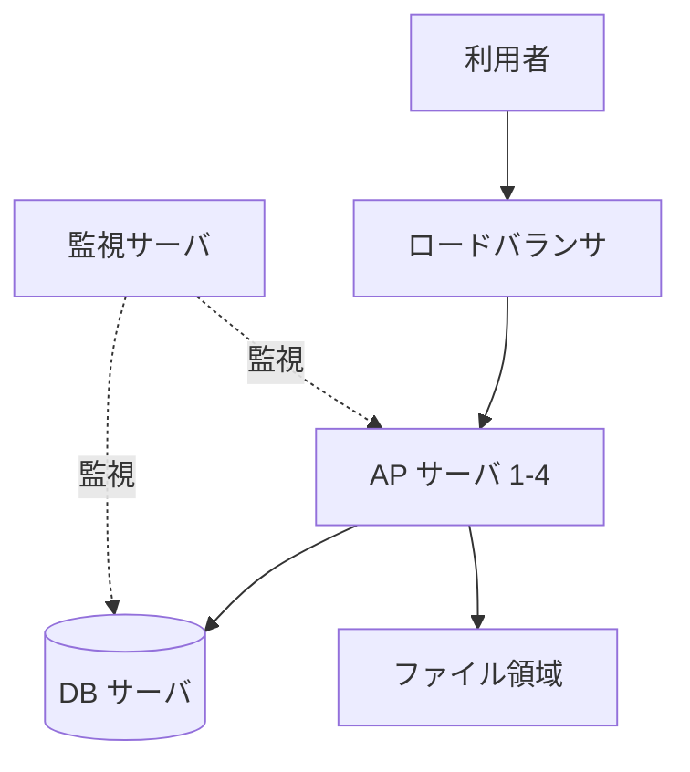
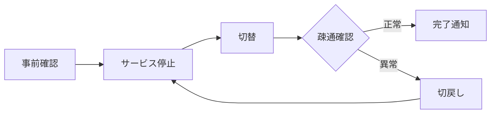

# 概要

本書はサンプルシステムのサーバ移行における構成および移行方式を定める。

## 目的

現行サーバの保守期限到来に伴い、可用性を維持したまま新サーバへ移行する。

## 適用範囲

サンプルシステムを構成するアプリケーションサーバおよび DB サーバを対象とする。

# システム構成

## 全体構成

システム全体の構成を図 1 に示す。詳細な機器仕様は表 1 を参照。

図: 全体構成

表: 機器一覧

| 機器 | 用途 | 台数 |
| --- | --- | --- |
| AP サーバ | アプリケーション実行 | 4 |
| DB サーバ | データ永続化 | 2 |

## ネットワーク構成

セグメントの分割方針は表 2 のとおり。

表: セグメント構成

| セグメント | 用途 | VLAN |
| --- | --- | --- |
| 業務系 | 画面アクセス | 100 |
| 管理系 | 監視・保守 | 200 |

# 移行方式

表 1 の AP サーバから順に切り替える。切替当日の流れを図 2 に示す。

図: 切替当日の流れ

